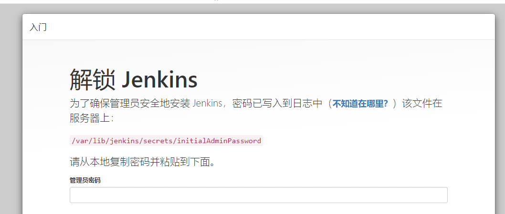
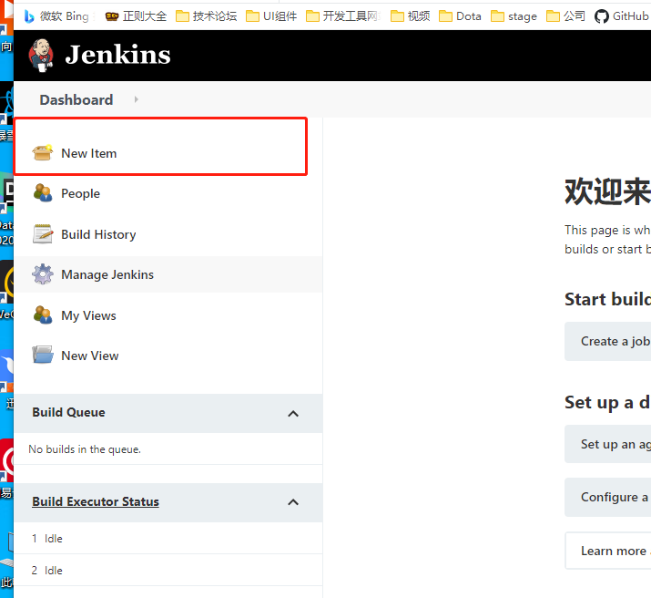

> 自动化集成/部署(CI & CD)Jenkins+GitHub+vitepress  提交触发webhook自动部署blog/vue项目
参考地址:https://www.jianshu.com/p/2fc8340de073
## 前置工作
配置:linux服务器一台(建议用阿里云/腾讯云) 
安装方式:linux使用rpm安装

## 1.安装jenkins
### 1.1安装java环境
```
yum -y list java*          查看所有可用版本
yum install -y java-1.8.0-openjdk-devel.x86_64       选择一个版本安装
java -version        查看安装的java版本
```
### 1.2下载jenkins的rpm安装包
最快的方式是去[github](https://github.com/jenkinsci/jenkins/releases)上下载，然后用xshell+xftp传到linux服务器上


我的rpm包路径(其实放哪无所谓)  /jenkins/jenkins-2.278-1.1.noarch.rpm 

```
cd /jenkins   进入到包所在的文件夹
rpm -ivh jenkins-2.278-1.1.noarch.rpm     解压jenkins
```

默认是(8080)，有必要修改一下配置文件的端口号,。我比较喜欢用xftp修改。
文件路径/etc/sysconfig/jenkins

在第56行附近修改自己的端口号
```
JENKINS_PORT="8888"
```
同时建议将权限放开为root，后面打包后，移动文件夹需要权限
在第29行附近
```
JENKINS_USER="root"
```

启动/关闭/重启 命令
```
service jenkins start 
service jenkins stop   
service jenkins restart   
```


打开页。你可能会发现页面很慢，很卡。需要替换一下镜像源
找到hudson.model.UpdateCenter.xml文件，用指令找find . -name  "SaleContractFromDC.jsp"
先回到根目录
cd /
find . -name  "hudson.model.UpdateCenter.xml"
发现路径在 /var/lib/jenkins/hudson.model.UpdateCenter.xml
将<url>https://updates.jenkins.io/update-center.json</url> 修改成<url>http://mirror.xmission.com/jenkins/updates/update-center.json</url> 
需要找到对应的密码。然后登录就行。  cat /var/lib/jenkins/secrets/initialAdminPassword

 
 相关插件安装:
 Mange Jenkins(管理Jenkins)>Manage Plugins(管理插件)>Available下搜索安装
1. Build Timeout     
2. Folders Plugin 
3. Git (必备)
4. OWASP Markup Formatter 
5. Timestamper 
6. Credentials Binding 
7. Github (拉取github地址)
8. Nodejs (执行打包脚本)   同时也前往 全局工具配置-》添加对应的Node配置
9. Locale (应该是自带了)
10. Localization: Chinese (Simplified) (与9配合可汉化)
 可能会遇到无法识别github地址的情况，前往linux中将git更新到最新，重启一下
 ```
 yum -y install git
 ```

开始创建任务.
1.点击创建任务



打包的目录所在位置
/var/lib/jenkins/workspace/nice-blog

需要将文件复制一份到nginx中
cp -r /var/lib/jenkins/workspace/nice-blog/docs/.vitepress/dist  /marlinos/nginx/1.18.0/html/nice-blog


