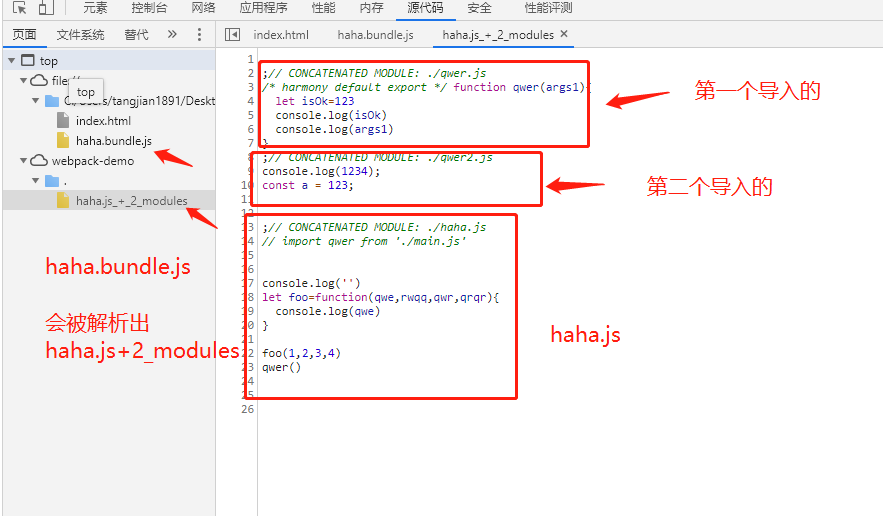
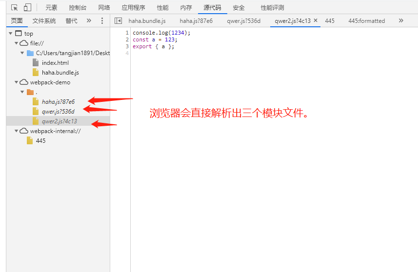

> webpack 是一个模块化打包工具。webpack 主要是用来开发应用程序。而 rollup 主要是用来开发 library 库(因为 rollup 可以一套代码，构建成 UMD,AMD,CJS,ESM,IIFE 等模式，更适合做库)

webpack 概念
1.input 入口
2.output 出口  
3.loader 将不同的文件类型转换为 webpack 能识别的模块(个人认为是最重要的概念)
4.plugins 插件(扩展能力)

## 相关概念

### 入口(entry)

```js
module.exports = {
  entry: "./main.js",
};
```

### 出口(output)

默认就是 bundle.js。当然也可以自己指定文件目录已经打包出来的文件名称

```js
  module.exports={
    output:{
      path:path.resolve(__dirname,'dist')
      filename:"bundle-nice.js"
    }
  }

```

### loader

> 可以将任意的文件以模块的方式 import 导入，这是 webpack 特有的。webpack 遵循万物皆模块
> 1.test 属性，用于表示出需要匹配哪些文件。
> 2.use 属性,进行转换时，使用哪个 loader

```js
module.exports = {
  input: "./main.js",
  output: {
    filename: "bundle.js",
  },
  module: {
    rules: [
      { test: /\.txt$/, use: "raw-loader" }, //以.txt结尾的文件，使用raw-loader解析
    ],
  },
};
```

### plugin

> 可对特定功能节点做增强。例如:打包压缩代码，打包打出 gzip 包，打包对图片资源做 base64 内联处理等

```js
module.exports = {
  plugins: [new HtmlWebpackPlugin({ template: "./src/index.html" })],
};
```

## 开始配置

关于 vue-cli 的配置。可以使用 vue inspect > output.js 打印所有的配置

> 开始从零增加一个配置。推荐查看 webpack 的指南，一步一步跟着配置

```js
npm i webpack -D
npm i webpack-cli -D  //在webpack4+需要webpack-cli,包括现在的5，都是需要的
```

> 执行 npx webpack 即可自动加载 webpack.config.js 中的配置(记得配置对应的配置文件)。或者添加到 script 标签中

### loader 相关

1. 想要引入 css 文件,但是 webpack 并不能识别。所以无法打入到 bundle 中。
   > 报错: Module parse failed: Unexpected token
   > 首先先引入 css-loader

```js
npm i css-loader -D
npm i style-loader -D
```

在 module.rules:Array<Object> 中进行 loader 配置 每个对象中都有 use 和 test 两个属性，匹配 css 文件，使用两个 loader，一个是解析 css 文件,一个是将解析后的 css 模块内容使用 style 标签自动插入.解析时自右向左，所以必须先使用 css-loader 解析

```js
  module: {
    rules: [
      {
        test: /\.css$/,
        use: ['style-loader',"css-loader"],
      },
    ],
  },
```

2. 想要引入图片文件。 引入图片文件将被复制到输出目录中，然后将地址转化为输出目录的图片文件的绝对地址
   注意：图片类型也算是文件类型的一种，实际上我们需要是将图片类型的路径转化为输出目录的图片文件的绝对地址即可。(不仅可以处理图片，还可以处理音频，视频，字体等文件)

```js
npm i file-loader -D

//  ----------配置-----------
module: {
  rules: [{ test: /\.png|jpg$/, use: "file-loader" }];
}

// ----------代码--------
import Image from "./assets/image.jpg";
console.log(Image); //输出目录图片的绝对地址 file:///C:/Users/tangjian1891/Desktop/webpack-demo/dist2/d7825376105e7be3e53763ed91d48d55.qwer
```

但是优化没有止境，你可能需要压缩一下你的图片.
可以使用 url-loader 做内联。vue-cli 的默认值是 4096 也就是 4K 大小会被内联。可以将 file-loader 配置的地方替换为 url-loader 配置。当符合 limit 的图片会被做内联处理直接打入 bundle 中，不符合的图片会在 url-loader 调用 file-loader 做路径打包。

**如果只安装了 url-loader 没有安装 file-loader,那么 limit 没命中的图片会出现打包报错 Cannot find module 'file-loader'**

**所以:即使你安装了 url-loader，也很推荐安装 file-loader，但是配置 loader 只需配置 url-loader 一个即可**

```js
npm i url-loader -D
// -----------配置--------
module:{
  rules:[
    { test: /\.png|jpg$/, use: {
      loader:"file-loader" ,
       options: {
            limit: 4096, //为vue-cli的默认大小
       },
    }}
  ]
}

```

3. 字体资源，同 2 图片资源一致

4. 其余类型的资源。例如 csv,xml 文件. 注:json 默认可解析

```js
npm i csv-loader xml-loader -D
// ------------配置------
module:{
  rules:[
    {
      test:/\.csv$/,
      use:"csv-loader"
    },
    {
      test:/\.xml$/,
      use:"xml-loader"
    },
  ]
}
```

### plugins 相关

1. 你会发现每次在 html 中手动引入打包的出来 bundle 麻烦。使用一个插件 html-webpack-plugin

```js
npm i html-webpack-plugin -D
// -----配置---
  plugins:[
    new HtmlWebpackPlugin()
  ]
  // 打包后，会自动生成一个html，并自动引入打包出来的相关bundle
```

2. 你会发现 dist 每次都是相同的覆盖，无用的仍然保留。所以需要清理/dist 输出目录。 clean-webpack-plugin 清理,使用也很简单

```js
npm i clean-webpack-plugin -D
// --------配置----
plugins:[new CleanWebpackPlugin()]

```

### 开发其他配置

1. 关于 source map
   devtool 属性,如果不配置的情况下。就是压缩代码，所有代码在一起，
   > 开发模式:我们一般希望更加精准的源码定位，所以需要牺牲速度。增加 bundle 体积.推荐 source-map 就可
   > 生产模式:分两种:1.完全舍弃源码映射，只要打包之后的 bundle 就行。 2.源码映射与 bundle 分别打包，部署 bundle,源码映射单独部署(可做错误信息监测)。或者限制普通用户访问 sourcemap

分类:

1.  打包后的代码。也就是不配置。那么完全没有 sourcemap 映射。(一般标准生产)
2.  生成后的代码。（eval）都在一个文件中，不能正确显示行数
3.  转换过的代码。（无法看，不利于定于，一般用于第三方库）
4.  原始源代码。利于精准定位
    3.1 eval-source-map (在 bundle 中采用将 sourcemap 转换为 DataUrl 后添加到 eval 中) build 慢 rebuild 快
    3.2 source-map 生成外部.map 文件(源码级别) 单独的文件，更加灵活

> eval 虽然代码都打在 bundle 中，但是单个模块拥有区分，可被浏览器解析 sourcemap。查看形式变成 入口.js+n_modules



> eval-source-map 浏览器解析时，可以解析出对应的源码文件。 每个模块相互分离，就像你编写那样。
> 

[sourcemap 文档地址](https://www.webpackjs.com/configuration/devtool/)

2. 起一个本地服务，便于开发.不然每次都要手动 build 一下，太麻烦了，热更新才是最好的

```js
npm i webpack-dev-server -D
// V4版本安装，可以再script脚本中加入

  "scripts": {
    "dev": "webpack-dev-server --open"
  },

  // V5版本后
    "scripts": {
    "dev": "webpack serve --open"
  },
  // V5版本的webpack可以采用回退webpack-cli。https://github.com/webpack/webpack-cli/issues/1948 回退webpack-cli版本也行,回退到"webpack-cli": "^3.3.12"，也可以使用V4的启动方式

  // -----------配置----
  devServer:{
    contentBase: "./dist2",  //目录
    port:9000 //端口号
    hot:true,//默认就是开启热更新的
  }

```

3.  是否需要压缩输出。webpack 可根据 mode 自动采用是否压缩。默认 production 为压缩，可手动更改为 mode:"development"，这样打包出来的代码将不会压缩。

    > 开发模式不需要压缩，开发模式下我们需要更多的 sourcemap，更精准的定位，热模块替换。 生产模式需要压缩，生产模式只关注更小更轻的 bundle 和 sourcemap

4.  指定环境。可以使用 NODE 的.process.env.NODE_ENV==='production'判断

```js
内置插件.  webpack.DefinePlugin 甚至可以重写process.env.NODE_ENV
// -------------配置----------
plugins:[
  new webpack.DefinePlugin({
    'process.env.NODE_ENV':JSON.stringify('这是什么默哀是飒'),
    'beijjing':JSON.stringify('这是beijjing啊啊啊')
  })
]

```

## vue-cli配置环境变量，配置html-webpack-plugin。

### 1.环境变量
vue-cli的环境变量默认有三种形式['development','production','test'],使用proceess.env.NODE_ENV可以取到
- vue-cli-service serve 起开发服务 为development
- vue-cli-service build 打包 为prodction
- vue-cli-service test:unit 测试为test

但是我们的实际情况不止，比如打包后还需要区分部署测试环境与生产环境。测试环境需要有调试面板,生产环境需要使用cdn，排除依赖等。

例子: 你需要在某个测试环境中使用调试面板.暂定这个自定义的模式为uat
```js
//  ---script启动脚本增加参数---
"scripts": {
    "build:uat": "vue-cli-service build --mode uat",
} 

```
// ------此时启动模式为uat,会自动加载.env.uat文件,参考下面的mode加载配置文件文档
.env.uat 文件 
> 使用自定义mode后，proceess.env.NODE_ENV默认为development，根据自身需求决定是否重写

> 自定义的变量必须要使用VUE_APP_开头.
```
# npm run build:uat 就走这个配置

# uat打包，需要手动注入NODE_ENV为'production',否则为'development'
NODE_ENV=production

# 当前环境的名称 自定义的变量,这样就可以实现在项目中自由使用了
VUE_APP_MODE=uat
```
[mode加载配置文件文档](https://cli.vuejs.org/zh/guide/mode-and-env.html#环境变量)

https://mp.weixin.qq.com/s/UrIH72bYufUxCoXs54QqlQ
